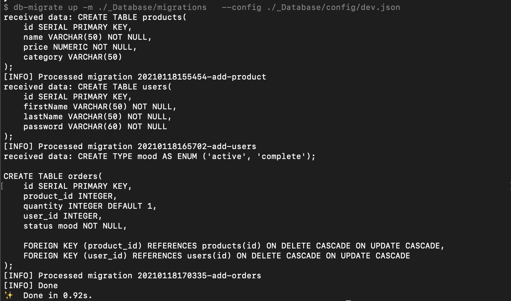
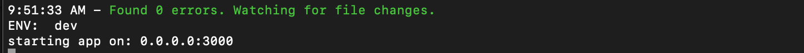
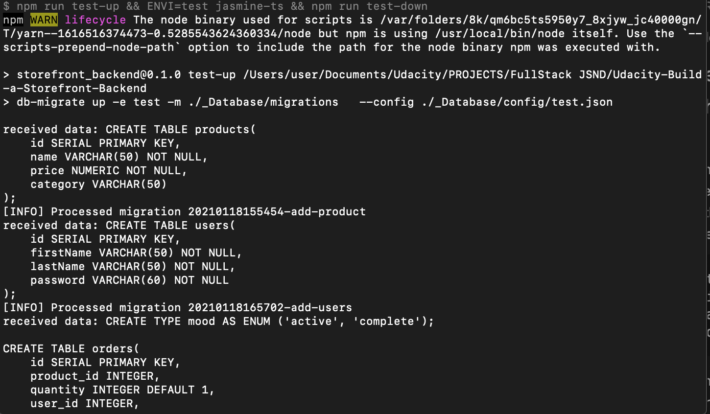
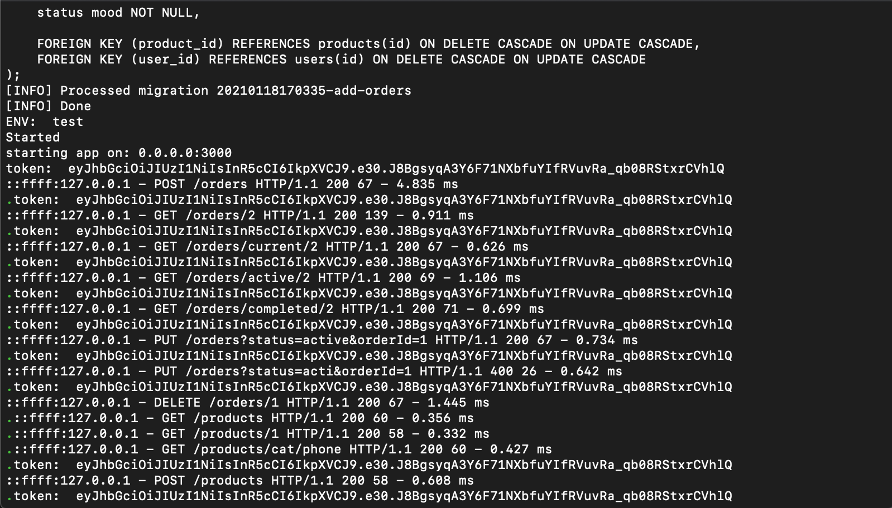
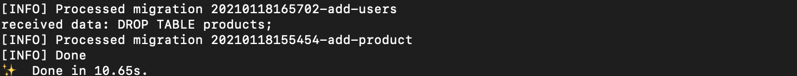

# Udacity: Build A Storefront Backend

This is a backend API build in Nodejs for an online store. It exposes a RESTful API that will be used by the frontend developer on the frontend. 

The database schema and and API route information can be found in the [REQUIREMENT.md](REQUIREMENTS.md) 

## Installation Instructions
This section contains all the packages used in this project and how to install them. However, you can fork this repo and run the following command at the root directory to install all packages.

`yarn` or `npm install`

### Packages

Here are some of the few packages that were installed.

#### express
`npm i -S express`
`npm i -D @types/express`

#### typescript
`npm i -D typescript`

#### db-migrate
`npm install -g db-migrate`

#### g
`npm install -g n`

#### rimraf 
`npm install --save rimraf`

#### cors
`npm install --save cors`

#### bcrypt
`npm -i bcrypt`
`npm -i -D @types/bcrypt`

#### morgan 
`npm install --save morgan`
`npm -i -D @types/morgan`

#### jsonwebtoken
`npm install jsonwebtoken --sav`
`npm -i -D @types/jsonwebtoken`

#### cross-env
`npm install --save-dev cross-env`

#### jasmine
`npm install jasmine @types/jasmine @ert78gb/jasmine-ts ts-node --save-dev`

#### supertest
`npm i supertest`
`npm i --save-dev @types/supertest`


## Set up Database
### Create Databases
We shall create the dev and test database.

- connect to the default postgres database as the server's root user `psql -U postgres`
- In psql run the following to create a user 
    - `CREATE USER shopping_user WITH PASSWORD 'password123';`
- In psql run the following to create the dev and test database
    - `CREATE DATABASE shopping;`
    - `CREATE DATABASE shopping_test;`
- Connect to the databases and grant all privileges
    - Grant for dev database
        - `\c shopping`
        - `GRANT ALL PRIVILEGES ON DATABASE shopping TO shopping_user;`
    - Grant for test database
        - `\c shopping_test`
        - `GRANT ALL PRIVILEGES ON DATABASE shopping_test TO shopping_user;`

### Migrate Database
Navigate to the root directory and run the command below to migrate the database 

`yarn dev-up`



## Enviromental Variables Set up
Bellow are the environmental variables that needs to be set in a `.env` file. This is the default setting that I used for development, but you can change it to what works for you. 

**NB:** The given values are used in developement and testing but not in production. 
```
DB_NAME = shopping
DB_NAME_TEST = shopping_test
DB_HOST = localhost
DB_PORT = 5432
DB_USER = shopping_user
DB_PASS= password123

BCRYPT_PASSWORD=my-name-is-enow-2021
SALT_ROUNDS=10
TOKEN_TEST = eyJhbGciOiJIUzI1NiIsInR5cCI6IkpXVCJ9.e30.J8BgsyqA3Y6F71NXbfuYIfRVuvRa_qb08RStxrCVhlQ
JWT_SECRET = 5ae8adc9731627905ebf0905dbe4a114ba7d8354ae1796772dfa523a2142761b78d48cbfcd98000bb94fbdbd8147f30de6b3484c3a060d389068204df6a50630
ENVI = dev
```

## Start App
`yarn watch` or `npm run watch`



### Running Ports 
After start up, the server will start on port `3000` and the database on port `5432`

## Endpoint Access
All endpoints are described in the [REQUIREMENT.md](REQUIREMENTS.md) file. 

## Token and Authentication
Tokens are passed along with the http header as 
```
Authorization   Bearer <token>
```

## Testing
Run test with 

`yarn test`

It sets the environment to `test`, migrates up tables for the test database, run the test then migrate down all the tables for the test database. 






## Important Notes 

### Environment Variables
Environment variables are set in the `.env` file and added in `.gitignore` so that it won't be added to github. However, I had provided the names of the variables that need to be set above. I also provided the values that were used in development and testing. 


### Changing Enviroment to testing 
I had set up two databases, one for development and the other for testing. During testing, I had to make sure the testing database is used instead of the developement database. 

To acheive this, I set up a variable in the `.env` file which is by default set to `dev`. During testing, the command `yarn test` will set this variable to `testing` in the package.json. Here is the complete command.
`npm run test-up && cross-env ENVI=test jasmine-ts && npm run test-down`

The first command migrates all tables then the second command changes the enviroment variable `ENVI` to testing, then the jasmine is run and then after testing, the database is reset. 

Note the `cross-env` in command above. Since this may have some issues in Windows, I had to use this pakcage [cross-env](https://www.npmjs.com/package/cross-env) to take care of it. This permits the changing of environment variable this way to work for all platforms
